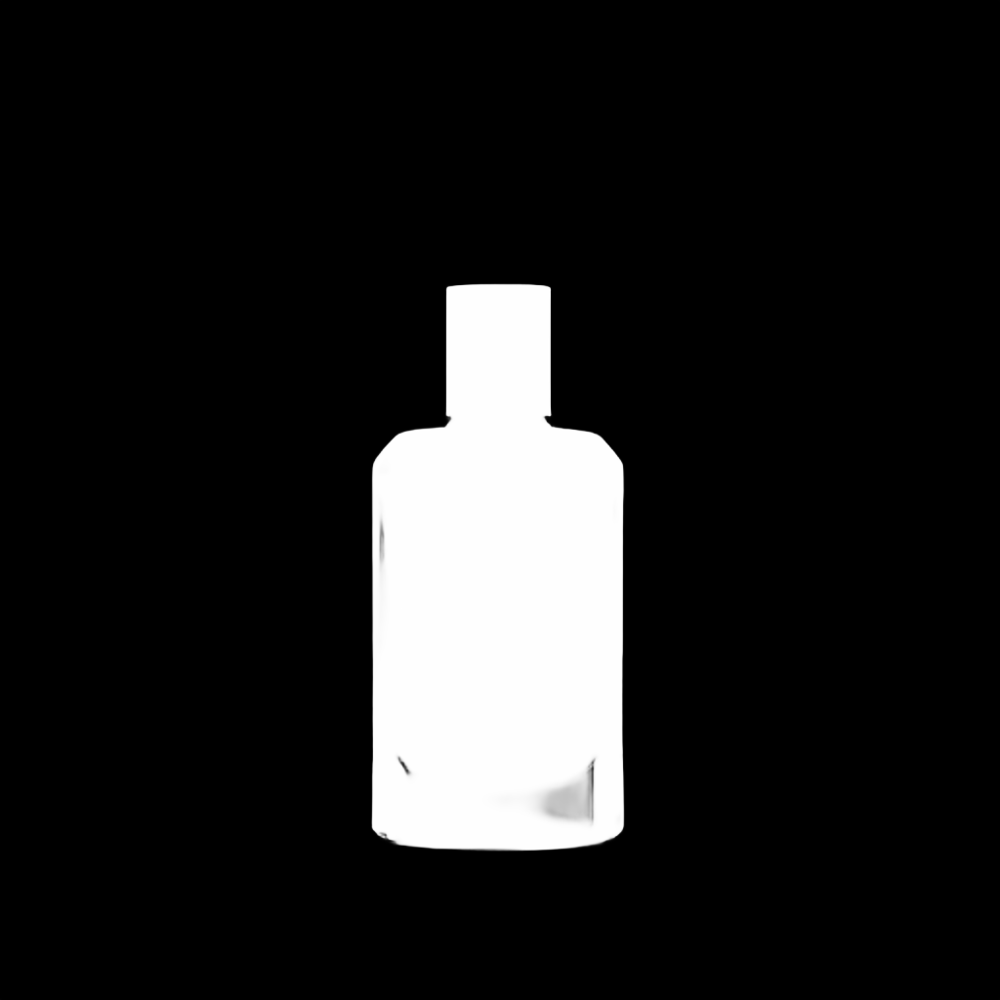

# ECCV2022/dis-background-removal Cog Model

Inspired by the huggingface space[ECCV2022/dis-background-removal](https://huggingface.co/spaces/ECCV2022/dis-background-removal), this is an implementation of [ECCV2022/dis-background-removal](https://github.com/xuebinqin/DIS) as a [Cog](https://github.com/replicate/cog) model.

## Development

Follow the [model pushing guide](https://replicate.com/docs/guides/push-a-model) to push your own model to [Replicate](https://replicate.com).

# Setup

Checkpoints file `isnet.pth` and `data_loader_cache` script are from the original repository: [xuebinqin/DIS](https://github.com/xuebinqin/DIS)

## Basic Usage

To run a prediction:

    cog predict -i image=@cologne.png

| Input | Output | Mask |
|-------|--------|------|
|  |  |  |